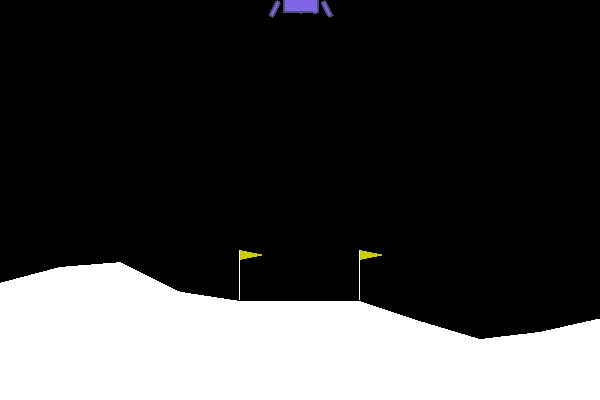
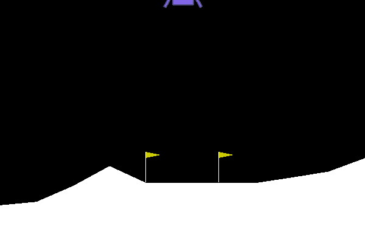
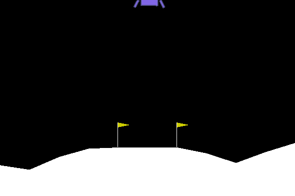
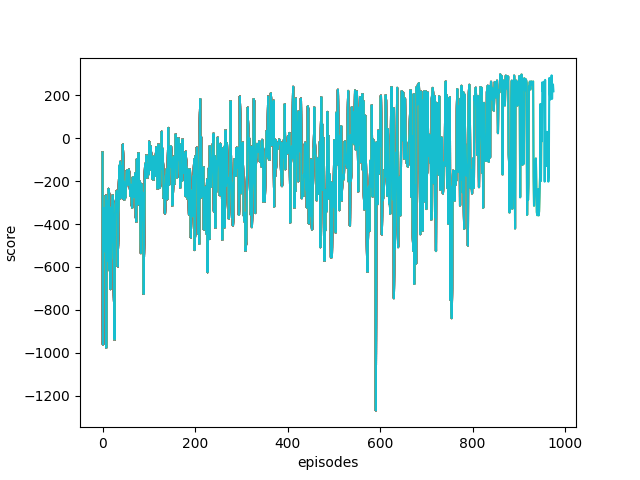

# Continuous Control with Deep Reinforcement Learning (DDPG)

This implements a reinforcement learning algorithm [DDPG](https://arxiv.org/abs/1509.02971). Using the methodology employed for DQN, DDPG can resolve continous action space environments.

Following shows that DDPG can solve one of the continuous action space environment in `OpenAI Gym`.

|Episode: 0|Episode: 500|Episode: 900|
|---|---|---|
||||

## Score Graph for `LunarLanderContinuous-v2`


## Environments

* Pytorch 1.8.1
* Python 3.8.20


Please refer `requirements.txt` for python packages for this repo.


pip is looking for torchvision==0.9.1+cpu on PyPI, but the “+cpu” versions are only hosted on PyTorch’s own wheel index, not on the default PyPI server.

```
python -m pip install --upgrade pip==23.2.1 setuptools==65.5.1 wheel==0.38.4
pip install gym==0.18.0
pip install torch==1.8.1 torchvision==0.9.1 torchaudio==0.8.1

pip install -r requirements-wsl.txt
```
